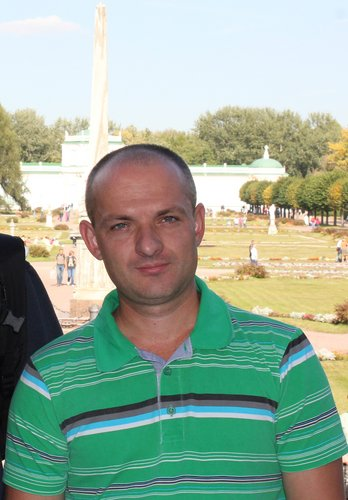

[RS SCHOOL](https://rs.school/)



# Andrei Artsiomenka
## Contact information:
* Phone: +375 29 7985933
* E-mail: andreiartsiomenka@gmail.com
* Discord: Andry Artemenko#7362
## About Myself:
1. performance.
2. teamwork skills.
3. self-awareness
## Knowledge of programming languages:
- PHP
- JAVA
- HTML/CSS
## Code Example
```
package by.basic.unit1_basics_of_software_code_development.line_program;

import java.util.Scanner;
/*
 * 1. Find the value of a function: z = ( (a – 3 ) * b / 2) + c.
 * 
 * */

public class task1 {
	public static void main(String[] args) {
        @SuppressWarnings("resource")
		Scanner scanner = new Scanner(System.in);
        double a = 0;
        double b = 0;
        double c = 0;

        System.out.print("Input a number a ,b ,c: ");
        while (!scanner.hasNextDouble()){
            scanner.nextLine();
            System.out.println("type not double");
        }
        a = scanner.nextDouble();
        b = scanner.nextDouble();
        c = scanner.nextDouble();

        System.out.printf("a=%f; b=%f; c=%f \n", a, b, c);

        double z = ( ( a - 3 ) * b / 2 ) + c;

        System.out.printf("z= ( ( %f - 3) * %f / 2 ) + %f = %f\n", a, b, c, z);

    }
}
```
## Work experience
* Brest signaling and communication distance
* Benning electrical and electronic engineering
## Education:
* Brest College of Railway Transport
* Brest State University named after A.S. Pushkin
## English language
I am a beginner at International Language House.
